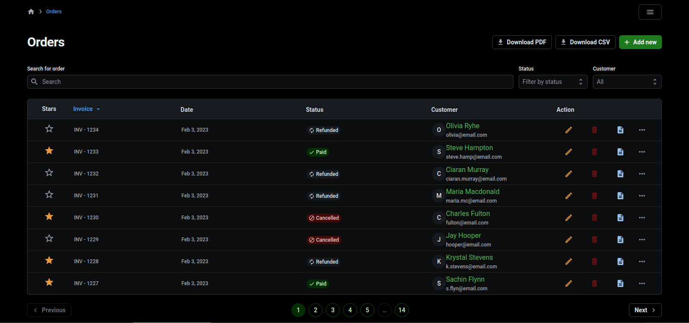
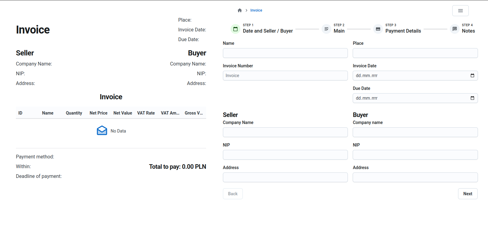

# Order and Invoice Management App

## Table of Contents

1. [Overview](#overview)
2. [Features](#features)
3. [Tech Stack](#tech-stack)
4. [Setup and Installation](#setup-and-installation)
5. [Project Structure](#project-structure)
6. [Firebase Configuration](#firebase-configuration)
7. [Running the Application](#running-the-application)
8. [Usage](#usage)

## Overview

This project is a React-based web application for managing orders and invoices. The application allows users to perform CRUD (Create, Read, Update, Delete) operations on orders. In the invoices section, users can generate invoices, export them as PDFs, and create summaries in CSV format.

#

## Features

- **Order Management**: Add, view, update, and delete orders.
- **Invoice Generation**: Create and manage invoices with options to export them as PDFs.
- **CSV Export**: Generate summaries and export data in CSV format.
- **Form Validation**: Uses `react-hook-form` `yup` for efficient form management and validation.
- **Responsive Design**: Built with `Joy UI` `Material UI` for a modern and responsive user interface.

## Tech Stack

- **React**: JavaScript library for building user interfaces.
- **TypeScript**: A typed superset of JavaScript that adds type safety to the code.
- **Firebase**: Backend-as-a-Service (BaaS) for authentication, database, and hosting.
- **React Hook Form**: A library for managing forms with easy validation.
- **Joy UI**: A set of React components that follow Google’s Material Design guidelines.
- **PDF Generation**: Uses libraries like `jsPDF` or `html2canvas` for PDF generation.
- **CSV Export**: Custom function for generating CSV files.

## Setup and Installation

**Clone the repository:**

1. Open project file
2. npm install
3. npm run dev
4. Open the browsers at <http://localhost:5731/>.

**Setup Firebase:**

1. Go to the Firebase Console.
2. Create a new project.
3. In the project settings, obtain your Firebase configuration.
4. Set up Firestore for the database and Firebase Authentication for managing users.
5. Environment Variables: Create a .env file in the root directory and add your Firebase configuration:

## Environment Variables

      REACT_APP_FIREBASE_API_KEY=your-api-key
      REACT_APP_FIREBASE_AUTH_DOMAIN=your-auth-domain
      REACT_APP_FIREBASE_PROJECT_ID=your-project-id
      REACT_APP_FIREBASE_STORAGE_BUCKET=your-storage-bucket
      REACT_APP_FIREBASE_MESSAGING_SENDER_ID=your-messaging-sender-id
      REACT_APP_FIREBASE_APP_ID=your-app-id

## Project Structure

- **`public/`**: Public resources that are directly accessible in the app.
- **`src/`**: The source code for the project.
  - **`api/`**: Firebase services and APIs.
  - **`assets/`**: All png file.
  - **`components/`**: Multiple UI components.
  - **`config/`**: Config of dependance.
  - **`context/`**: App state.
  - **`hooks/`**: Custom hooks.
  - **`pages/`**: React components for each page.
  - **`schema/`**: Schema for validation in yup.
  - **`types/`**: Reusable type.
  - **`ui/`**: Reusable UI.
- **`App.tsx`**: The main component of the app.
- **`main.tsx`**: The entry point of the app.
- **`...`**: Other core files.
- **`.env`**: Environment variables.
- **`package.json`**: Project dependencies and scripts.
- **`README.md`**: Project documentation.

## Firebase Configuration

The app uses Firebase for data storage and authentication. Make sure you have configured Firestore and Firebase Authentication in the Firebase Console. The api/firebase.ts file in the project contains the configuration for initializing Firebase.

## Usage

Orders: Navigate to the Orders section to create, view, edit, or delete orders.
Invoices: Go to the Invoices section to generate invoices. You can then export them as PDFs or create CSV summaries.

## Inportant

The user assumes full responsibility for using the application.
